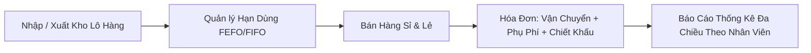

<div align="center">

# 🌾 THIẾT KẾ PHÁT TRIỂN & BẢO TRÌ PHẦN MỀM
### HỆ THỐNG QUẢN LÝ BÁN HÀNG CÔNG TY NÔNG DƯỢC AN GIANG
**TRƯỜNG ĐẠI HỌC AN GIANG — ĐẠI HỌC QUỐC GIA TP. HỒ CHÍ MINH**

---

[](https://docs.microsoft.com/en-us/dotnet/csharp/)
[](https://dotnet.microsoft.com/)
[](https://visualstudio.microsoft.com/)
[](https://refactoring.guru/design-patterns)
[](https://github.com/nobianh78/ThietKeBaoTriPhanMem)

<br/>

> *"Tối ưu hóa kiến trúc phần mềm, ứng dụng đầy đủ các mẫu thiết kế (Design Patterns) và chuẩn mực bảo trì ISO/IEC/IEEE 14764 vào bài toán kinh doanh nông dược thực tế."*

</div>

---

## 👤 THÔNG TIN HỌC VIÊN THỰC HIỆN

| 🎯 Thông tin | 📝 Chi tiết |
|:---|:---|
| **Học viên thực hiện** | **NGUYỄN TUẤN ANH** |
| **Mã học viên (MSSV)** | `DPM235407` |
| **Lớp / Khóa** | Cao học Kỹ thuật Phần mềm (K24) |
| **Đơn vị đào tạo** | Trường Đại học An Giang |
| **Học phần** | Thiết kế phát triển và Bảo trì Phần mềm |
| **Email liên hệ** | `anh_dpm235407@student.agu.edu.vn` |
| **Repository GitHub** | [nobianh78/ThietKeBaoTriPhanMem](https://github.com/nobianh78/ThietKeBaoTriPhanMem) |

---

## 📋 MỤC LỤC ĐIỀU HƯỚNG
1. [Bối cảnh đề tài & Nghiệp vụ thực tế](#-bối-cảnh-đề-tài--nghiệp-vụ-thực-tế)
2. [Tuần 01: Creational Design Patterns (5 Mẫu Khởi Tạo)](#-tuần-01-creational-design-patterns-5-mẫu-khởi-tạo)
3. [Tuần 02: Behavioral Design Patterns (10 Mẫu Hành Vi)](#-tuần-02-behavioral-design-patterns-10-mẫu-hành-vi)
4. [Cấu trúc thư mục Repository](#-cấu-trúc-thư-mục-repository)
5. [Hướng dẫn cài đặt và chạy chương trình](#-hướng-dẫn-cài-đặt-và-chạy-chương-trình)
6. [Tài liệu tham khảo](#-tài-liệu-tham-khảo)

---

## 🌾 BỐI CẢNH ĐỀ TÀI & NGHIỆP VỤ THỰC TẾ

Dự án tập trung vào việc **Bảo trì, Tái cấu trúc (Refactoring)** và phát triển mới các tính năng cho **Hệ thống Quản lý Bán hàng của Công ty Nông Dược An Giang** (theo đề tài đồ án môn học).



### 🎯 Các yêu cầu trọng tâm đã được giải quyết:
- [x] **Quản lý xuất nhập kho theo lô:** Hệ thống tự tính và phân bổ lô hàng theo nguyên tắc **ngày hết hạn trước xuất trước (FEFO)** hiển thị đầy đủ số lô và HSD trên phiếu xuất, hoặc xuất theo chỉ định của người dùng.
- [x] **Phương pháp tính giá vốn xuất kho:** Cung cấp 2 cơ chế hoán đổi linh hoạt tại runtime: **Bình quân gia quyền** hoặc **Nhập trước xuất trước (FIFO)**.
- [x] **Nghiệp vụ hóa đơn toàn diện:** Cho phép nhập phát sinh chi phí vận chuyển xe tải/xe máy, dịch vụ phụ trợ (phun thử nghiệm, bốc vác hàng), nhập chiết khấu khuyến mãi mùa vụ; hỗ trợ **Undo / Redo** và lưu trữ lịch sử trạng thái hóa đơn (Snapshot/Memento).
- [x] **Bảo mật & Phân quyền chặt chẽ:** Kiểm soát chuỗi đăng nhập (Chain of Responsibility), phân định quyền hạn rõ ràng giữa Quản lý, Kế toán, Thủ kho và Nhân viên bán hàng.
- [x] **Thống kê báo cáo đa chiều (Visitor Pattern):** Cho phép người dùng chọn khoảng thời gian **từ ngày đến ngày** để in báo cáo giá trị tồn kho, tổng phụ phí vận chuyển/dịch vụ, và thống kê chi tiết doanh số, chiết khấu theo từng nhân viên đăng nhập.

---

## 🏗️ TUẦN 01: CREATIONAL DESIGN PATTERNS (5 MẪU KHỞI TẠO)

> Thư mục: [`DPM235407_NguyenTuanAnh_Tuan01_greationalDesignPatter/`](./DPM235407_NguyenTuanAnh_Tuan01_greationalDesignPatter/)  
> Solution: `DPM235407_NguyenTuanAnh_Tuan01_greationalDesignPatter.sln`

Gồm **10 Projects** độc lập phân chia thành 2 nhóm:

| STT | Mẫu thiết kế | Dự án Lý thuyết (Refactoring.Guru) | Dự án Thực tế (Nông Dược An Giang) | Mô tả ứng dụng thực tế |
|:---:|:---|:---|:---|:---|
| 1 | **Factory Method** | `..._Factory-DP` | `..._Factory_Real_NhanVien_DP` | Khởi tạo động và cấu hình quyền hạn cho Nhân viên Bán hàng và Quản lý |
| 2 | **Abstract Factory** | `..._Abstract-DP` | `..._Abstract_Real_BaoCao_DP` | Bộ tạo họ báo cáo (Báo cáo bán hàng, Báo cáo kho) đồng bộ theo vai trò người dùng |
| 3 | **Builder** | `..._Builder-DP` | `..._Builder_Real_HoaDon_DP` | Xây dựng từng bước Hóa đơn bán hàng phức tạp (gồm tiền hàng, phí ship, chiết khấu, thuế) |
| 4 | **Prototype** | `..._Prototype-DP` | `..._Prototype_Real_LoHang_DP` | Nhân bản nhanh thông tin Lô thuốc bảo vệ thực vật khi nhập các lô hàng tương tự |
| 5 | **Singleton** | `..._Singleton-DP` | `..._Singleton_Real_Database_DP` | Quản lý duy nhất trạng thái Phiên đăng nhập (Session) và kết nối cơ sở dữ liệu |

<details>
<summary><b>🔍 Bấm vào đây để xem chi tiết nghiệp vụ Tuần 01</b></summary>

- **Factory Method:** Định nghĩa giao diện `INhanVien`, các Factory con `PhongNhanSuBanHang` và `PhongNhanSuQuanLy` chịu trách nhiệm tạo đúng đối tượng nhân viên tương ứng.
- **Abstract Factory:** Giao diện `IBaoCaoFactory` cho phép tạo cặp báo cáo `IBaoCaoBanHang` và `IBaoCaoTonKho` tương thích tuyệt đối cho cấp Quản lý hoặc Nhân viên.
- **Builder:** `HoaDonDayDuBuilder` tách biệt quá trình xây dựng phức tạp của hóa đơn khỏi biểu diễn của nó, cho phép tái sử dụng quy trình xây dựng.
- **Prototype:** Lớp `LoHang` triển khai cơ chế Shallow / Deep Copy giúp nhân viên nhập kho nhanh chóng sao chép lô hàng mới mà không cần nhập lại thông tin quy cách, hoạt chất.
- **Singleton:** Lớp `PhienDangNhap` áp dụng mẫu Thread-Safe Singleton đảm bảo chỉ duy nhất một phiên làm việc của nhân viên đang đăng nhập được duy trì trong suốt phiên thực thi.

</details>

---

## ⚡ TUẦN 02: BEHAVIORAL DESIGN PATTERNS (10 MẪU HÀNH VI)

> Thư mục: [`DPM235407_NguyenTuanAnh_Tuan02_BehavioralPatterns/`](./DPM235407_NguyenTuanAnh_Tuan02_BehavioralPatterns/)  
> Solution: `DPM235407_NguyenTuanAnh_Tuan02_BehavioralPatterns.sln`

Gồm đầy đủ **10 mẫu thiết kế hành vi** với **20 Projects C# .NET 8.0** độc lập:

| STT | Mẫu thiết kế | Dự án Lý thuyết (Guru) | Dự án Thực tế (Nông Dược An Giang) | Giải quyết nghiệp vụ đề bài PDF |
|:---:|:---|:---|:---|:---|
| 1 | **Chain of Responsibility** | `..._ChainOfResponsibility-DP` | `..._ChainOfResponsibility_Real_XacThuc_DP` | Chuỗi 4 bước xác thực đăng nhập: Kiểm tra dữ liệu rỗng $\rightarrow$ Xác thực tài khoản CSDL $\rightarrow$ Kiểm tra tài khoản bị khóa $\rightarrow$ Phân quyền truy cập chức năng |
| 2 | **Command** | `..._Command-DP` | `..._Command_Real_HoaDon_DP` | Đóng gói thao tác hóa đơn thành các Command: Thêm thuốc, Phí vận chuyển xe tải, Dịch vụ phụ trợ, Giảm giá khuyến mãi; Hỗ trợ hoàn tác (Undo/Redo) |
| 3 | **Iterator** | `..._Iterator-DP` | `..._Iterator_Real_KhoHang_DP` | Xuất lô thuốc theo cấu hình: Tự động phân lô theo HSD hết hạn trước xuất trước (FEFO) in chi tiết số lô & HSD trên phiếu xuất, hoặc xuất theo chỉ định |
| 4 | **Mediator** | `..._Mediator-DP` | `..._Mediator_Real_DieuPhoi_DP` | Trung gian điều phối giao tiếp lỏng lẻo giữa 4 phân hệ: Bán Hàng $\rightarrow$ Kho Hàng (trừ tồn lô) $\rightarrow$ Kế Toán (chiết khấu & hóa đơn) $\rightarrow$ Vận Chuyển giao hàng |
| 5 | **Memento** | `..._Memento-DP` | `..._Memento_Real_HoaDon_DP` | Tạo bản sao chụp (Snapshot) độc lập lưu trạng thái hóa đơn khi chỉnh sửa phụ phí/giảm giá, cho phép phục hồi (Rollback) về bất kỳ bản nháp nào trước đó |
| 6 | **Observer** | `..._Observer-DP` | `..._Observer_Real_TonKho_DP` | Giám sát tồn kho an toàn, tự động bắn cảnh báo khi tồn kho thuốc BVTV $\le 15$, cảnh báo thuốc cận hạn sử dụng ($< 30$ ngày) và thông báo chương trình khuyến mãi |
| 7 | **State** | `..._State-DP` | `..._State_Real_DonHang_DP` | Quản lý máy trạng thái vòng đời đơn hàng: Mới tạo $\rightarrow$ Đã xác nhận (khóa giá & trừ kho) $\rightarrow$ Đang giao hàng $\rightarrow$ Hoàn tất / Hủy đơn; ngăn thao tác sai |
| 8 | **Strategy** | `..._Strategy-DP` | `..._Strategy_Real_GiaXuat_DP` | Tùy chọn phương pháp tính giá xuất kho sản phẩm: **Bình quân gia quyền** hoặc **Nhập trước xuất trước (FIFO)** theo đúng Mục 3 đề bài PDF |
| 9 | **Template Method** | `..._TemplateMethod-DP` | `..._TemplateMethod_Real_BanHang_DP` | Khung sườn quy trình chuẩn bán hàng nông dược gồm 7 bước; phân nhánh riêng cho **Bán sỉ đại lý/HTX** (xe tải, chiết khấu lớn) và **Bán lẻ nông dân** (shipper, voucher) |
| 10 | **Visitor** | `..._Visitor-DP` | `..._Visitor_Real_ThongKe_DP` | Thống kê đa chiều từ ngày đến ngày: Thống kê doanh thu & chiết khấu theo nhân viên đăng nhập; Thống kê tổng hợp giá trị tồn kho, cước vận chuyển, dịch vụ phụ |

<details>
<summary><b>🔍 Bấm vào đây để xem chi tiết nghiệp vụ Tuần 02</b></summary>

### 1. Chain of Responsibility (`..._Real_XacThuc_DP`)
- Triển khai chuỗi liên kết `KiemTraDuLieuTrongHandler` $\rightarrow$ `XacThucTaiKhoanHandler` $\rightarrow$ `KiemTraKhoaTaiKhoanHandler` $\rightarrow$ `PhanQuyenTruyCapHandler`.
- Ngăn chặn triệt để tình trạng nhân viên bán hàng truy cập trái phép vào các chức năng quản trị như cấu hình kho hoặc báo cáo tài chính mật.

### 2. Command (`..._Real_HoaDon_DP`)
- Hóa đơn `HoaDonBanHang` đóng vai trò Receiver, các lớp lệnh `ThemSanPhamCommand`, `ThemPhiVanChuyenCommand`, `ThemDichVuPhatSinhCommand`, `ApDungGiamGiaCommand` triển khai `Execute()` và `Undo()`.
- Lớp `NhanVienThuNganInvoker` duy trì ngăn xếp `Stack<IHoaDonCommand>` giúp hoàn tác bất kỳ thao tác nào khi khách hàng đổi ý.

### 3. Iterator (`..._Real_KhoHang_DP`)
- Giải quyết chính xác bài toán Mục 3 PDF: Quản lý hàng trăm lô thuốc BVTV.
- Cung cấp `XuatTheoHanSuDungIterator` (tự động ưu tiên xuất lô cận date trước) và `XuatTheoChiDinhIterator` (xuất đúng lô khách chọn), in phiếu xuất kho chuẩn có số lô và HSD.

### 4. Mediator (`..._Real_DieuPhoi_DP`)
- `DieuPhoiBanHangMediator` đứng giữa kết nối `BoPhanBanHang`, `BoPhanKhoHang`, `BoPhanKeToan`, `BoPhanVanChuyen`.
- Khi có đơn hàng mới, các bên phản hồi qua Mediator mà không cần tham chiếu trực tiếp đến nhau, giúp hệ thống đạt tính chất *Loose Coupling*.

### 5. Memento (`..._Real_HoaDon_DP`)
- `HoaDonBanHang` (Originator) tạo ra `HoaDonMemento` chứa bản sao Deep Copy của toàn bộ danh sách mặt hàng, chi phí giao vận và chiết khấu.
- `LichSuHoaDonCaretaker` lưu giữ các điểm phục hồi, cho phép rollback tức thì khi nhân viên nhập sai phụ phí.

### 6. Observer (`..._Real_TonKho_DP`)
- `KhoNongDuocSubject` tự động quét kho và gửi thông báo `ThongTinCanhBaoKho` tới `BoPhanThuKhoObserver`, `NhanVienBanHangObserver`, và `QuanLyCuaHangObserver`.
- Đảm bảo ban quản lý phản ứng kịp thời với thuốc cận hạn sử dụng, tránh thất thoát tài sản.

### 7. State (`..._Real_DonHang_DP`)
- Quản lý trạng thái qua các lớp: `TrangThaiMoiTao`, `TrangThaiDaXacNhan`, `TrangThaiDangGiaoHang`, `TrangThaiHoanThanh`, `TrangThaiDaHuy`.
- Khóa chặt không cho phép sửa đổi sản phẩm hoặc tiền hàng một khi đơn đã được xác nhận và trừ lô kho.

### 8. Strategy (`..._Real_GiaXuat_DP`)
- Cài đặt 2 chiến lược kế toán kho: `TinhGiaBinhQuanGiaQuyenStrategy` và `TinhGiaNhapTruocXuatTruocStrategy`.
- `QuanLyKhoNongDuocContext` cho phép người dùng thay đổi thuật toán tính giá vốn chỉ bằng phương thức `SetStrategy(...)`.

### 9. Template Method (`..._Real_BanHang_DP`)
- Lớp `QuyTrinhBanHangTemplate` định nghĩa khung 7 bước xử lý đơn hàng cố định.
- Lớp con `QuyTrinhBanSi` áp dụng chiết khấu theo khối lượng (10%-15%) và vận chuyển xe tải; `QuyTrinhBanLe` áp dụng giảm giá theo voucher và shipper giao hàng nội hạt.

### 10. Visitor (`..._Real_ThongKe_DP`)
- Các phần tử dữ liệu: `HoaDonBanHangElement`, `LoHangTonKhoElement`, `DichVuPhatSinhElement` chấp nhận `IBaoCaoVisitor`.
- `BaoCaoTheoNhanVienTuNgayDenNgayVisitor` và `BaoCaoTonKhoVaChiPhiPhuTuNgayDenNgayVisitor` giúp trích xuất mọi báo cáo phức tạp theo khoảng thời gian mà không cần sửa đổi cấu trúc dữ liệu gốc.

</details>

---

## 🌳 CẤU TRÚC THƯ MỤC REPOSITORY

```
ThietKeBaoTriPhanMem/
│
├── .gitignore
├── README.md                                                          <-- Tài liệu tổng quan này
│
├── DPM235407_NguyenTuanAnh_Tuan01_greationalDesignPatter/             <-- BÀI TẬP TUẦN 01: CREATIONAL PATTERNS
│   ├── DPM235407_NguyenTuanAnh_Tuan01_greationalDesignPatter.sln
│   ├── DPM235407_NguyenTuanAnh_Tuan01_Factory-DP/
│   ├── DPM235407_NguyenTuanAnh_Tuan01_Factory_Real_NhanVien_DP/
│   ├── DPM235407_NguyenTuanAnh_Tuan01_Abstract-DP/
│   ├── DPM235407_NguyenTuanAnh_Tuan01_Abstract_Real_BaoCao_DP/
│   ├── DPM235407_NguyenTuanAnh_Tuan01_Builder-DP/
│   ├── DPM235407_NguyenTuanAnh_Tuan01_Builder_Real_HoaDon_DP/
│   ├── DPM235407_NguyenTuanAnh_Tuan01_Prototype-DP/
│   ├── DPM235407_NguyenTuanAnh_Tuan01_Prototype_Real_LoHang_DP/
│   ├── DPM235407_NguyenTuanAnh_Tuan01_Singleton-DP/
│   └── DPM235407_NguyenTuanAnh_Tuan01_Singleton_Real_Database_DP/
│
└── DPM235407_NguyenTuanAnh_Tuan02_BehavioralPatterns/                 <-- BÀI TẬP TUẦN 02: BEHAVIORAL PATTERNS
    ├── DPM235407_NguyenTuanAnh_Tuan02_BehavioralPatterns.sln
    ├── README.md
    ├── DPM235407_NguyenTuanAnh_Tuan02_ChainOfResponsibility-DP/
    ├── DPM235407_NguyenTuanAnh_Tuan02_ChainOfResponsibility_Real_XacThuc_DP/
    ├── DPM235407_NguyenTuanAnh_Tuan02_Command-DP/
    ├── DPM235407_NguyenTuanAnh_Tuan02_Command_Real_HoaDon_DP/
    ├── DPM235407_NguyenTuanAnh_Tuan02_Iterator-DP/
    ├── DPM235407_NguyenTuanAnh_Tuan02_Iterator_Real_KhoHang_DP/
    ├── DPM235407_NguyenTuanAnh_Tuan02_Mediator-DP/
    ├── DPM235407_NguyenTuanAnh_Tuan02_Mediator_Real_DieuPhoi_DP/
    ├── DPM235407_NguyenTuanAnh_Tuan02_Memento-DP/
    ├── DPM235407_NguyenTuanAnh_Tuan02_Memento_Real_HoaDon_DP/
    ├── DPM235407_NguyenTuanAnh_Tuan02_Observer-DP/
    ├── DPM235407_NguyenTuanAnh_Tuan02_Observer_Real_TonKho_DP/
    ├── DPM235407_NguyenTuanAnh_Tuan02_State-DP/
    ├── DPM235407_NguyenTuanAnh_Tuan02_State_Real_DonHang_DP/
    ├── DPM235407_NguyenTuanAnh_Tuan02_Strategy-DP/
    ├── DPM235407_NguyenTuanAnh_Tuan02_Strategy_Real_GiaXuat_DP/
    ├── DPM235407_NguyenTuanAnh_Tuan02_TemplateMethod-DP/
    ├── DPM235407_NguyenTuanAnh_Tuan02_TemplateMethod_Real_BanHang_DP/
    ├── DPM235407_NguyenTuanAnh_Tuan02_Visitor-DP/
    └── DPM235407_NguyenTuanAnh_Tuan02_Visitor_Real_ThongKe_DP/
```

---

## 🚀 HƯỚNG DẪN CÀI ĐẶT VÀ CHẠY CHƯƠNG TRÌNH

### 1. Yêu cầu môi trường
- Hệ điều hành: Windows 10 / 11
- [.NET 8.0 SDK](https://dotnet.microsoft.com/download/dotnet/8.0) trở lên
- [Visual Studio 2022](https://visualstudio.microsoft.com/) (với workload *.NET Desktop Development*) hoặc [Visual Studio Code](https://code.visualstudio.com/)

### 2. Clone Repository
```powershell
git clone https://github.com/nobianh78/ThietKeBaoTriPhanMem.git
cd ThietKeBaoTriPhanMem
```

### 3. Biên dịch toàn bộ các Solution
```powershell
# Biên dịch Solution Tuần 01: Creational Patterns
dotnet build DPM235407_NguyenTuanAnh_Tuan01_greationalDesignPatter/DPM235407_NguyenTuanAnh_Tuan01_greationalDesignPatter.sln

# Biên dịch Solution Tuần 02: Behavioral Patterns (20 Projects)
dotnet build DPM235407_NguyenTuanAnh_Tuan02_BehavioralPatterns/DPM235407_NguyenTuanAnh_Tuan02_BehavioralPatterns.sln
```
> *Tất cả các dự án đều biên dịch thành công 100%: `0 Error(s), 0 Warning(s)`.*

---

### 4. Chạy thử nghiệm các Project Tuần 02 (Behavioral Patterns)

Di chuyển vào thư mục Tuần 02:
```powershell
cd DPM235407_NguyenTuanAnh_Tuan02_BehavioralPatterns
```

Chạy từng mẫu thiết kế thực tế tương ứng:
```powershell
# 1. Quản lý phân quyền & đăng nhập (Chain of Responsibility)
dotnet run --project DPM235407_NguyenTuanAnh_Tuan02_ChainOfResponsibility_Real_XacThuc_DP

# 2. Thao tác hóa đơn, phụ phí & hoàn tác Undo (Command)
dotnet run --project DPM235407_NguyenTuanAnh_Tuan02_Command_Real_HoaDon_DP

# 3. Phân lô xuất kho theo HSD FEFO hoặc chỉ định (Iterator)
dotnet run --project DPM235407_NguyenTuanAnh_Tuan02_Iterator_Real_KhoHang_DP

# 4. Điều phối liên phòng ban Bán Hàng - Kho - Kế Toán - Giao Vận (Mediator)
dotnet run --project DPM235407_NguyenTuanAnh_Tuan02_Mediator_Real_DieuPhoi_DP

# 5. Lưu trữ snapshot & phục hồi bản thảo hóa đơn (Memento)
dotnet run --project DPM235407_NguyenTuanAnh_Tuan02_Memento_Real_HoaDon_DP

# 6. Giám sát cảnh báo tồn an toàn & thuốc cận date (Observer)
dotnet run --project DPM235407_NguyenTuanAnh_Tuan02_Observer_Real_TonKho_DP

# 7. Quản lý vòng đời đơn hàng nông dược (State)
dotnet run --project DPM235407_NguyenTuanAnh_Tuan02_State_Real_DonHang_DP

# 8. Tính giá xuất kho Bình quân gia quyền / FIFO (Strategy)
dotnet run --project DPM235407_NguyenTuanAnh_Tuan02_Strategy_Real_GiaXuat_DP

# 9. Quy trình bán hàng sỉ đại lý vs bán lẻ nông dân (Template Method)
dotnet run --project DPM235407_NguyenTuanAnh_Tuan02_TemplateMethod_Real_BanHang_DP

# 10. Thống kê báo cáo đa chiều từ ngày đến ngày (Visitor)
dotnet run --project DPM235407_NguyenTuanAnh_Tuan02_Visitor_Real_ThongKe_DP
```

---

## 📚 TÀI LIỆU THAM KHẢO

1. **Refactoring.Guru**: [Design Patterns in C# (Creational, Structural, Behavioral)](https://refactoring.guru/design-patterns/csharp)
2. **Erich Gamma, Richard Helm, Ralph Johnson, John Vlissides (GoF)**: *Design Patterns: Elements of Reusable Object-Oriented Software*, Addison-Wesley.
3. **Tiêu chuẩn ISO/IEC/IEEE 14764:2006**: *Software Engineering - Software Life Cycle Processes - Maintenance*.
4. **Tài liệu Đồ án thực hành**: *Đề bài Bảo trì và Tái cấu trúc Hệ thống Quản lý Bán hàng Công ty Nông Dược An Giang*, Khoa CNTT - Trường Đại học An Giang.

---

<div align="center">

**© 2026 Nguyễn Tuấn Anh (MSSV: DPM235407) — Trường Đại học An Giang**  
*Mọi ý kiến đóng góp xin vui lòng tạo Issue hoặc Pull Request trên Repository.*

</div>
